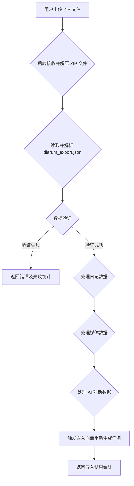

# Diarum 日记应用导入导出解决方案 (优化版)

## 1. 概述

本方案旨在为 Diarum 日记应用设计一套优化后的导入导出功能，使用户能够以统一、便捷的方式备份、迁移和恢复其日记数据。方案将确保数据完整性，并提供清晰的导入导出反馈。导出的数据包将包含日记文本、关联图片和 AI 对话记录等所有相关信息。**嵌入向量（Embedding）将不在导入导出范围内，而是在导入后根据文本内容重新生成。**

## 2. 导出功能设计

### 2.1 导出格式与内容

为简化用户操作并确保数据完整性，系统将统一导出为一个 **ZIP 压缩包**。该压缩包内部结构如下：

```
导出文件名.zip
├── diarum_export.json  # 包含所有日记的结构化数据和元数据
├── markdown/           # 包含每篇日记的 Markdown 格式文本
│   ├── 2026-02-03_我的日记标题.md
│   └── ...
└── media/              # 包含所有关联的媒体文件
    ├── image1.jpg
    ├── video1.mp4
    └── ...
```

**详细内容说明**：

1.  **`diarum_export.json` (主数据文件)**：
    *   **格式**：JSON 格式。
    *   **内容**：包含用户所有日记的完整结构化数据和元数据。这将包括 `diaries`、`media` 和 `chat` 三个集合的所有字段，确保数据无损导出。媒体文件在 JSON 中将以相对于 `media/` 目录的路径引用（例如：`"media": [{"id": "media1", "path": "media/image1.jpg"}]`）。
    *   **AI 对话**：默认包含所有关联的 AI 对话记录。

2.  **`markdown/` (日记文本文件)**：
    *   **格式**：Markdown (.md) 格式。
    *   **内容**：每篇日记对应一个 Markdown 文件。文件名格式为 `YYYY-MM-DD_日记标题.md`（若无标题则使用日期作为文件名）。日记内容中的图片将以 Markdown 语法链接到 `media/` 目录下的相应文件（例如：``）。

3.  **`media/` (媒体文件目录)**：
    *   **内容**：包含所有日记中引用的原始图片、视频等媒体文件。文件名为原始文件名。

### 2.2 导出逻辑

1.  **用户触发**：用户在前端点击“导出”按钮。
2.  **后端处理**：
    *   **数据查询**：后端 (Go) 从 PocketBase 数据库中查询用户的所有日记 (`diaries`)、关联媒体 (`media`) 和 AI 对话 (`chat`) 数据。
    *   **文件生成**：
        *   生成 `diarum_export.json` 文件，包含所有查询到的结构化数据，并处理媒体文件的相对路径引用。
        *   为每篇日记生成独立的 Markdown 文件，并处理图片链接到 `media/` 目录。
        *   从文件存储中收集所有关联的媒体文件到临时 `media/` 目录。
    *   **ZIP 打包**：将 `diarum_export.json` 文件、`markdown/` 目录及其内容、`media/` 目录及其内容打包成一个 ZIP 压缩文件。
    *   **直接下载与反馈**：
        *   通过新的 API 接口 (`/api/v1/export`) 返回生成的 ZIP 文件供用户直接下载。
        *   前端接收到下载成功通知后，显示导出结果统计：
            *   **总日记条目数**：例如 100 条
            *   **成功导出日记条目数**：例如 100 条
            *   **失败日记条目数**：例如 0 条
            *   **总媒体文件数**：例如 50 个
            *   **成功导出媒体文件数**：例如 50 个
            *   **失败媒体文件数**：例如 0 个

## 3. 导入功能设计

### 3.1 导入逻辑

1.  **用户上传**：用户在前端上传之前导出的 ZIP 压缩包。
2.  **后端处理**：
    *   **文件接收与解压**：后端 (Go) 接收用户上传的 ZIP 文件，并将其解压到服务器的临时目录。
    *   **JSON 解析**：读取并解析 `diarum_export.json` 文件，获取所有待导入的日记、媒体和 AI 对话数据。
    *   **数据验证**：对解析后的数据进行严格验证，确保数据结构和类型符合 Diarum 的要求。
    *   **数据导入与冲突处理**：
        *   **日记导入**：遍历 JSON 中的日记数据。
            *   根据日记的 `id` 检查数据库中是否已存在。如果存在，则**跳过**该日记的导入。
            *   如果不存在，则将日记数据（包括文本内容、心情、天气、AI 对话引用等）写入 PocketBase 的 `diaries` 集合。
        *   **媒体导入**：遍历 JSON 中的媒体数据。
            *   将解压后的媒体文件从临时 `media/` 目录移动或复制到 Diarum 应用配置的永久媒体存储位置。
            *   根据媒体的 `id` 检查数据库中是否已存在。如果存在，则**跳过**该媒体记录的导入。
            *   如果不存在，则将媒体记录（包括 `filename`、`mime`、`size`、`url` 等）写入 PocketBase 的 `media` 集合，并更新 `url` 为实际存储路径。
            *   更新日记与媒体之间的关联关系。
        *   **AI 对话导入**：遍历 JSON 中的 AI 对话数据。
            *   根据 AI 对话的 `id` 检查数据库中是否已存在。如果存在，则**跳过**该对话的导入。
            *   如果不存在，则将对话数据写入 PocketBase 的 `chat` 集合，并更新与日记的关联关系。
    *   **嵌入向量处理**：**导入完成后，系统应触发一个异步任务，根据新导入的日记内容重新生成并存储嵌入向量。**
    *   **API 响应**：通过新的 API 接口 (`/api/v1/import`) 返回导入结果统计：
        *   **总待导入日记条目数**：例如 100 条
        *   **成功导入日记条目数**：例如 80 条
        *   **跳过日记条目数**：例如 20 条 (已存在)
        *   **失败日记条目数**：例如 0 条
        *   **总待导入媒体文件数**：例如 50 个
        *   **成功导入媒体文件数**：例如 45 个
        *   **跳过媒体文件数**：例如 5 个 (已存在)
        *   **失败媒体文件数**：例如 0 个

### 3.2 导入流程图



## 4. 建议的技术栈与实现

*   **后端 (Go)**：
    *   使用 Go 标准库 `archive/zip` 进行 ZIP 文件的创建和解压。
    *   使用 `encoding/json` 进行 JSON 数据的序列化和反序列化。
    *   利用 PocketBase 的 SDK 进行数据库操作，特别是查询、创建和更新记录。
    *   实现新的 API 路由 (`/api/v1/export`, `/api/v1/import`)，处理文件上传和下载。
    *   实现文件系统操作，用于媒体文件的移动和存储。
    *   **新增**：实现触发嵌入向量重新生成任务的逻辑。
*   **前端 (Svelte)**：
    *   提供简洁的用户界面，用于触发导出和上传导入文件。
    *   使用 `fetch` API 调用后端导入导出接口，并处理文件上传的进度显示。
    *   展示后端返回的详细导入导出统计信息。

## 5. 总结

此优化方案提供了一个更加自动化和用户友好的 Diarum 日记应用导入导出功能。通过统一的 ZIP 格式，确保了所有类型数据（不含嵌入向量）的完整性和一致性。详细的统计反馈机制将使用户对导入导出过程有清晰的了解。默认包含 AI 对话数据，并自动处理图片链接和导入冲突，同时明确了嵌入向量的重新生成机制，进一步提升了用户体验和系统效率。

## 6. 参考文献

[1] [Exporting your journal entries - Diarly](https://diarly.app/help/how-to-export-journals)
[2] [Exporting entries - Day One](https://dayoneapp.com/guides/tips-and-tutorials/exporting-entries/)
[3] [Import, Export & Publish - Journey](https://help.journey.cloud/en/category/import-export-and-publish-1rixq78/)
[4] [Import and Export Day One JSON Now Available on the Web - Day One](https://dayoneapp.com/releases/import-and-export-web/)
[5] [Migrating Day One Journal Entries to Obsidian - Tyler.io](https://tyler.io/2025/06/23/migrating-day-one-journal-entries-to-obsidian/)
