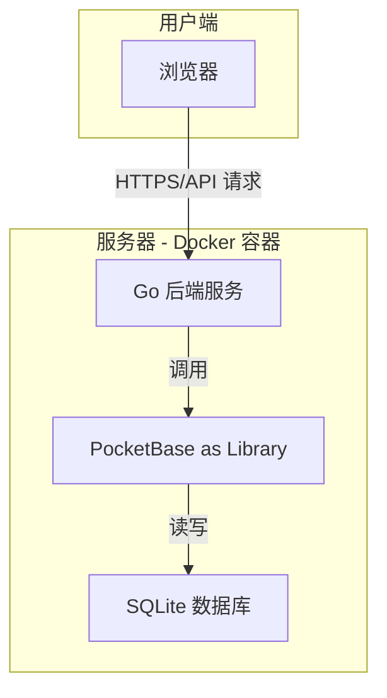

# Diarum 项目规划文档

---

## 1. 产品规划 (Product Requirements)

### 1.1. 项目愿景与定位

**项目名称**: Diarum

**愿景**: 打造一款极简、灵动且功能强大的开源自托管日记应用，深度聚焦个人日记的核心体验，并通过 AI 技术赋能，帮助用户更好地记录、回顾和理解自己的生活。

**核心定位**: 面向注重隐私、数据所有权和优质体验的个人日记爱好者与生活记录者。

**核心原则**:

- **极简专注**: 打开即写，默认展示今日编辑页面，无干扰。
- **深度回顾**: 提供多种时间维度的回顾方式，让日记"活"起来。
- **AI 智能**: 利用大语言模型（LLM）生成周期性报告，发掘数据价值。
- **隐私优先**: 完全自托管，数据 100% 由用户掌控。
- **性能卓越**: 追求快速、流畅、不卡顿的用户体验。
- **开放互联**: 提供稳定、可靠、文档完善的 API，鼓励第三方生态发展。

### 1.2. 核心功能规划 (Roadmap)

#### V1 - 最小可行产品 (MVP)

此阶段的目标是快速验证核心体验：**记录与回顾**。

| 模块 | 功能点 | 详细描述 |
| :--- | :--- | :--- |
| **用户系统** | 单用户认证 | 首次启动时设置用户名和密码，后续登录使用。 |
| **核心编辑** | 今日日记 | 打开应用直接进入今日日记的 Markdown 编辑器。 |
| | 自动保存 | 用户输入时，系统在后台无感知地自动保存。 |
| **核心导航** | 前后一天 | 提供"前一天"和"后一天"的快速切换按钮。 |
| | 日历跳转 | 提供一个日历视图，可以快速跳转到任意指定日期。 |
| **数据管理** | 基础搜索 | 支持对所有日记内容进行关键词全文检索。 |
| **开放性** | 基础 API | 提供稳定的 CRUD (Create, Read, Update, Delete) API 用于日记条目。 |
| **部署** | 一键部署 | 提供 `docker-compose.yml` 文件，整合 Go 后端和 PocketBase，实现单命令启动。 |

#### V2 - 核心功能完善

此阶段的目标是丰富日记的**组织维度**和**回顾方式**。

| 模块 | 功能点 | 详细描述 |
| :--- | :--- | :--- |
| **高级导航** | 去年今日 | 在查看当日日记时，展示往年今日的内容。 |
| | 日记漫游 | 提供一个"随机漫游"按钮，随机跳转到过去的一篇日记。 |
| **组织方式** | 标签系统 | 支持为每篇日记打上多个标签，并提供按标签筛选日记的功能。 |
| **丰富维度** | 心情与天气 | （可选）在日记中记录当天的心情和天气情况。 |
| **编辑器** | 图片上传 | 支持在日记中上传图片，图片存储于 PocketBase。 |

#### V3 - AI 智能与高级功能

此阶段的目标是引入 **AI 能力**和**高级数据管理**，形成产品护城河。

| 模块 | 功能点 | 详细描述 |
| :--- | :--- | :--- |
| **AI 助手** | 周期性报告 | 用户可配置自己的 LLM API Key（如 OpenAI），应用调用 API 生成周报、月报、年报。 |
| | 情感分析 | （可选）基于 AI 分析，生成一段时间内的情绪变化曲线图。 |
| **高级管理** | 高级搜索 | 支持按日期范围、标签、心情、天气等多维度组合搜索。 |
| | 数据导出 | 支持将所有日记导出为 Markdown 文件压缩包或单个 JSON 文件。 |
| **生态互联** | Webhooks | 当创建或更新日记时，可以触发 Webhook 通知到其他服务。 |
| | Telegram Bot | 提供一个 Telegram Bot，允许用户通过聊天快速记录日记片段。 |

### 1.3. 非功能性需求

- **性能**: 页面加载时间 < 1秒，API 响应时间 < 200ms。
- **安全**: 密码加密存储，API 需 Token 认证。
- **可维护性**: 代码结构清晰，有良好的注释和文档。
- **兼容性**: 优先保证 Chrome、Firefox、Safari 等现代浏览器的体验。

---

## 2. 技术设计 (Technical Design)

### 2.1. 架构设计

Diarum 将采用**单体应用 (Monolithic) 架构**，将 Go 后端与 PocketBase 数据库后端打包成一个独立的二进制文件。前端是一个独立的单页应用 (SPA)，通过 API 与后端通信。这种架构旨在实现极致的部署简洁性，符合自托管应用的核心理念。

#### 架构图



#### 请求流程

1.  用户通过浏览器访问 Diarum 的 Web 前端。
2.  前端静态资源（HTML/CSS/JS）由 Go 后端提供服务。
3.  前端应用通过 RESTful API 向 Go 后端发起数据请求（如获取、保存日记）。
4.  Go 后端接收到 API 请求，调用嵌入的 PocketBase Go 库来执行相应的数据库操作。
5.  PocketBase 操作底层的 SQLite 数据库文件 (`data.db`)。
6.  Go 后端将从 PocketBase 获取的数据格式化为 JSON，返回给前端。

### 2.2. 技术栈选型

| 分层 | 技术 | 选型理由 |
| :--- | :--- | :--- |
| **后端** | **Go** | 高性能、静态编译、跨平台，适合构建单一二进制文件，简化部署。 |
| | **PocketBase (Go Library)** | 作为核心的"后端即服务"，提供了数据库、用户认证、文件存储和实时 API 的能力，极大简化了开发。 |
| | **Gin Web Framework** | 一个轻量级且高性能的 Go Web 框架，用于快速构建 RESTful API 路由。 |
| **前端** | **SvelteKit** | 一个现代、高性能的前端框架。其编译时优化的特性与项目的"极简、性能"理念高度契合。 |
| | **Tailwind CSS** | 提供原子化的 CSS 类，可以快速构建现代化且高度可定制的 UI，而无需编写大量自定义 CSS。 |
| | **shadcn-svelte** | 一个基于 Tailwind CSS 的组件库，提供美观、可访问的基础 UI 组件，加速开发。 |
| | **Milkdown** | 一个插件驱动的所见即所得 Markdown 编辑器，提供优秀的编辑体验和高度的可扩展性。 |
| **数据库** | **SQLite** | 轻量、零配置、文件即数据库，完美契合自托管和单体应用的场景。由 PocketBase 内置管理。 |
| **部署** | **Docker & Docker Compose** | 实现环境隔离和一键部署，是现代自托管应用的最佳实践。 |
| **CI/CD** | **GitHub Actions** | 自动化构建、测试和发布 Docker 镜像的流程。 |

### 2.3. 数据库设计 (PocketBase Collections)

#### `users` 集合

此集合由 PocketBase 自动创建和管理，用于存储用户信息和处理认证。

#### `diaries` 集合

用于存储核心的日记内容。

| 字段名 | 类型 | 描述 | 约束 |
| :--- | :--- | :--- | :--- |
| `date` | `Date` | 日记的日期 | 必填 |
| `content` | `Editor` | 日记的正文内容 (Markdown/JSON) | |
| `tags` | `Relation` | 关联的标签 | 多对多，关联 `tags` 集合 |
| `mood` | `Text` | 当天的心情 | 可选 |
| `weather` | `Text` | 当天的天气 | 可选 |
| `owner` | `Relation` | 日记的所属用户 | 必填，关联 `users` 集合 |

**复合唯一索引**: `(date, owner)` 确保每个用户每天只能有一篇日记。

#### `tags` 集合

用于管理日记的标签。

| 字段名 | 类型 | 描述 | 约束 |
| :--- | :--- | :--- | :--- |
| `name` | `Text` | 标签的名称 | 必填 |
| `owner` | `Relation` | 标签的所属用户 | 必填，关联 `users` 集合 |

**复合唯一索引**: `(name, owner)` 确保每个用户的标签名是唯一的。

#### `settings` 集合

用于存储用户的个性化配置，特别是敏感信息。

| 字段名 | 类型 | 描述 | 约束 |
| :--- | :--- | :--- | :--- |
| `owner` | `Relation` | 配置的所属用户 | 必填，唯一，关联 `users` 集合 |
| `openai_api_key` | `Text` | 用户的 OpenAI API Key | 加密存储 |
| `openai_base_url` | `Text` | 自定义的 OpenAI API 地址 | 可选 |
| `ai_summary_prompt` | `Text` | AI 生成报告的自定义 Prompt | 可选 |

### 2.4. API 设计 (初稿)

API 将遵循 RESTful 风格，所有路由以 `/api/` 为前缀。

- **认证**: `POST /api/auth/login` - 用户登录，返回 JWT Token。
- **日记**:
  - `GET /api/diaries/:date` - 获取指定日期的日记。
  - `POST /api/diaries` - 创建或更新一篇日记。
  - `GET /api/diaries/search?q=<keyword>` - 搜索日记。
  - `GET /api/diaries/exists?dates=2023-01-01,2023-01-02` - 批量检查哪些日期存在日记。
- **标签**:
  - `GET /api/tags` - 获取用户的所有标签。
- **AI**:
  - `POST /api/ai/summary` - 请求生成周期性报告。

### 2.5. 部署方案

项目将提供一个 `docker-compose.yml` 文件作为官方推荐的部署方式。

```yaml
version: '3.8'
services:
  diarum:
    image: your_dockerhub_username/diarum:latest
    container_name: diarum
    restart: unless-stopped
    ports:
      - "8090:8090" # 假设应用监听 8090 端口
    volumes:
      - ./diarum_data:/app/pb_data # 将 PocketBase 的数据目录挂载到宿主机
```

用户只需执行 `docker-compose up -d` 即可完成部署。所有数据（包括 SQLite 数据库文件和上传的图片）都将持久化在 `diarum_data` 目录中。
